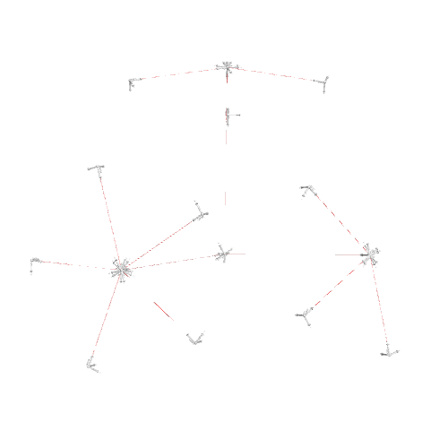
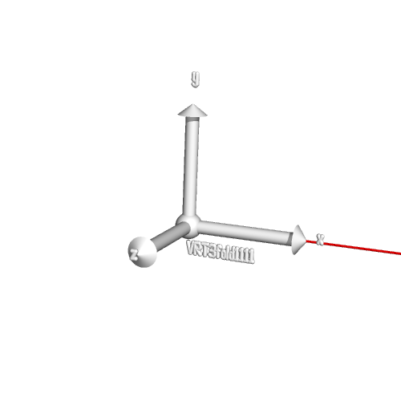

# SymmetryHandler

If you need to handcraft a symmetry file for Rosetta or visualize said or another symmetry file from Rosetta you've come to the right place. This is a simple utility library that's great at doing both. 

## Handcrafting symmetry files. 

To handcraft a symmetryfile take a look at the SymmetrySetup class. 

You can import it as: 

`from symmetryhandler.symmetryhandler import SymmetrySetup`

It has appropiate getters and setters that easily can be used to set jumps and vrts and connect them as well. It can also read in another symmetry file if one needs to modify an existing one. 

## Visualing symmetry

Take a look at the *visualization* functions for the SymmetrySetup class. A script `visualize_symmetry.py` can be used to visualize the symmetry file. Use `visualize_symmetry.py -h` to see more. To run directly in PyMOL run pymol as `pymol -R`.

## Some pictures 

